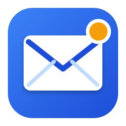
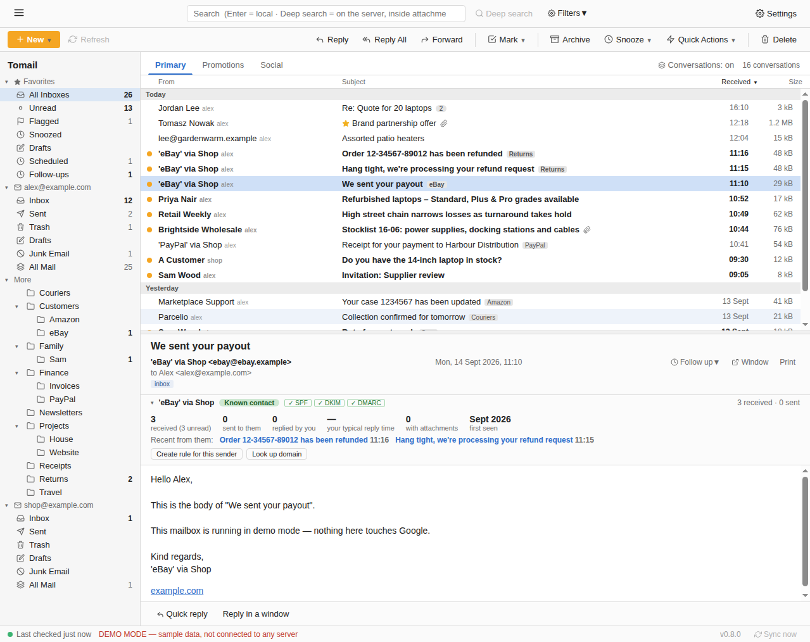
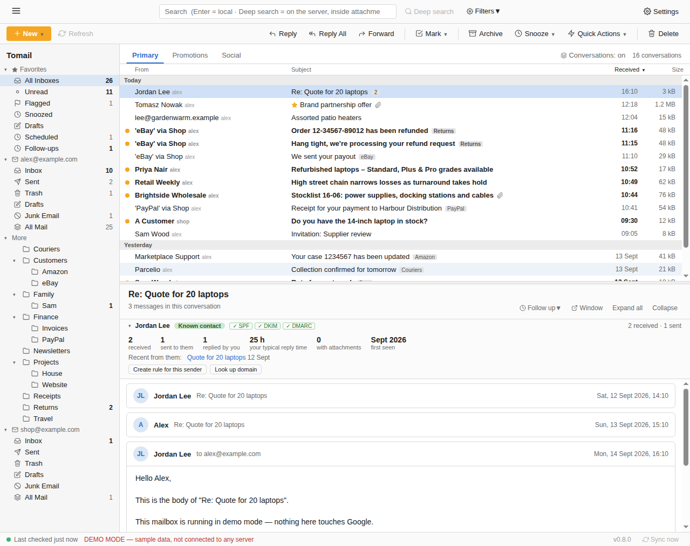
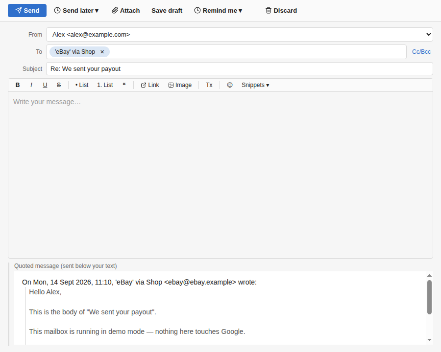
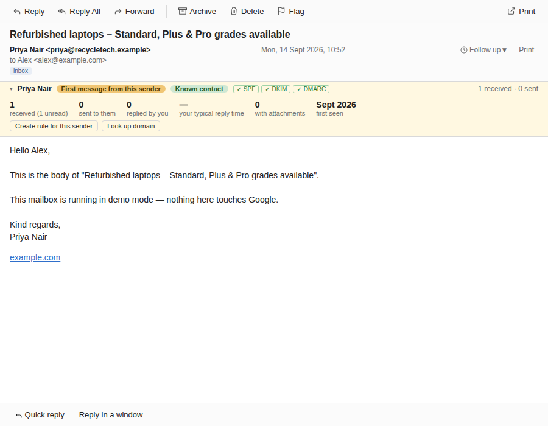
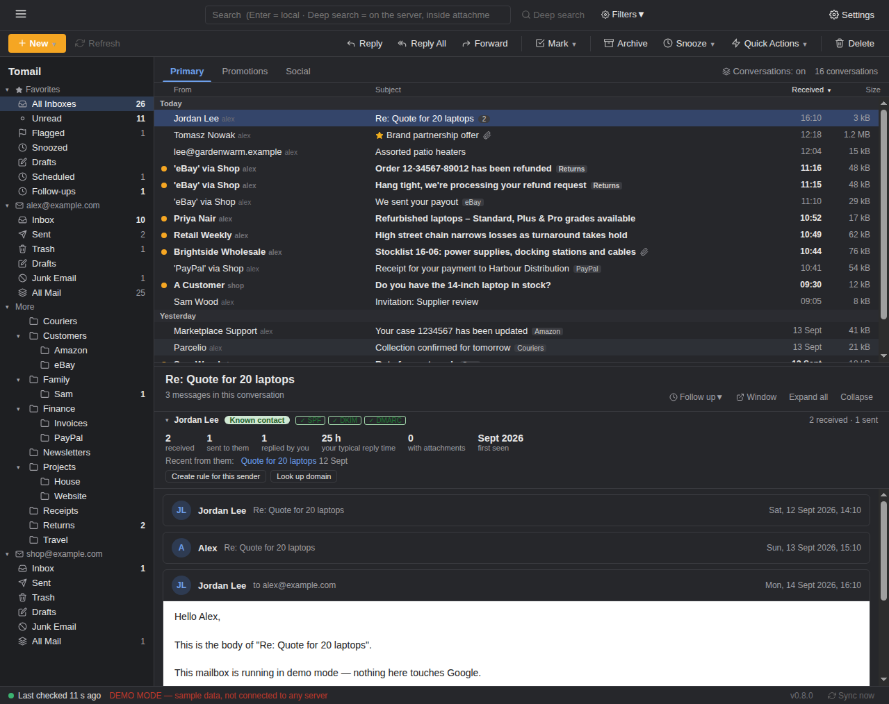

<p align="center"></p>
<h1 align="center">Tomail</h1>
<p align="center">A fast, keyboard-friendly desktop email client for Gmail, Google Workspace and any IMAP mailbox.<br>Windows · macOS · Linux · optional local AI</p>

<p align="center"></p>

Tomail keeps a local copy of your mail, so folders, unread counts and search are instant even on a 60,000-message inbox, and it works when you're offline. Everything you do (read, flag, archive, move, snooze, rules) is applied to your provider too, so your phone and webmail stay in step.

## Download

Grab the installer for your machine from the **[latest release](https://github.com/TommyT1988/tomail/releases/latest)**:

| Platform | File |
|---|---|
| Windows (x64) | `Tomail-x.y.z-win-x64.exe` |
| Windows on ARM | `Tomail-x.y.z-win-arm64.exe` |
| Windows, either (bigger) | `Tomail-x.y.z-win.exe` — one installer carrying both, picks the right one |
| macOS, Apple Silicon | `Tomail-x.y.z-mac-arm64.dmg` |
| macOS, Intel | `Tomail-x.y.z-mac-x64.dmg` |
| Linux (x64) | `Tomail-x.y.z-linux-x86_64.AppImage` or `-linux-amd64.deb` |
| Linux (ARM64) | `Tomail-x.y.z-linux-arm64.AppImage` or `-linux-arm64.deb` |

Installers aren't code-signed yet, so the first launch shows a warning: on Windows click **More info → Run anyway**; on macOS right-click the app and choose **Open** (on macOS 15 and later go to **System Settings → Privacy & Security** and click **Open Anyway** after the first blocked attempt). Because the macOS build is unsigned, **auto-update doesn't work on macOS yet**; download new versions from this page. Windows and Linux update themselves. On Linux, `chmod +x` the AppImage and run it, or add it to your app menu with [Gear Lever](https://flathub.org/apps/it.mijorus.gearlever). Tomail updates itself from these releases.

## First run

Click **Sign in with Google** and sign in through your browser. Tomail asks only for `gmail.modify` (read, label, archive, trash, send) and never for permanent delete unless you grant it separately later. Your password never passes through the app. Sign-in tokens are stored in Tomail's local database, encrypted with a key held by your operating system's keychain (Windows DPAPI, macOS Keychain, GNOME Keyring / KWallet on Linux); on a Linux system without a keyring service they're stored unencrypted, and Settings says which applies.

For any other provider, **Settings → Accounts → Add other account (IMAP)**: type the address, and Tomail looks up the server settings (built-in list of major providers plus Mozilla's provider database). Yahoo, iCloud, Fastmail and Gmail-over-IMAP need an app password. Outlook.com and Microsoft 365 have mostly retired password sign-in for IMAP, so they need an app password where the tenant allows it; Microsoft OAuth is on the roadmap.

> **Google verification status.** Tomail's Google app is currently in *Testing* mode: only addresses on the tester list can sign in, and Google expires those sign-ins every 7 days (Tomail shows a "Sign in again" button). Lifting that requires Google's verification review. IMAP accounts have no such limit.

## What it does

**Reading**
- Three-pane layout: folders and labels on the left, message list with Primary / Promotions / Social tabs grouped by day, reading pane below with a draggable divider
- Conversation view (toggle in the list header) stacks a thread as cards
- Open any message in its own window (`o`), or print it (`p`)
- Remote images blocked by default with a per-message "Load images"; HTML rendered in a sandbox; links open in your browser
- Attachment previews: inline image thumbnails, a viewer for images, PDFs and text
- Calendar invitations show as a card with Accept / Maybe / Decline that replies to the organiser
- **Sender card**: history with each sender, your typical reply time, first-contact and authentication (SPF/DKIM/DMARC) flags
- **Phishing warnings**: look-alike domains, links whose text and destination differ, brand names on foreign addresses, urgent payment wording from strangers
- **Quick reply** under every message (Ctrl+Enter to send), and inline reply from notifications on macOS
- **Tabs**: Ctrl+click a folder or middle-click a message to open it in a tab; searches open in their own tab

<p align="center"></p>

**Triage**
- Read / unread, flag, archive, delete, move, junk, all instant and synced, with **Undo**
- **Snooze** (later today, tomorrow, weekend, next week, or a time); the wake time is stored on the server so every device running Tomail wakes it
- **Follow-up reminders**: "remind me if no reply by…" on anything you send; clears itself when they reply, nags you if they don't
- **Rules**: file, label, archive, flag, read, junk or trash new mail by sender, recipient, subject, body or attachment; "Create rule from sender" in Quick Actions
- Trash and Junk offer Restore, Delete forever and Empty folder
- Sortable columns, including **oldest first** if you like today's mail at the bottom (it opens there, and scrolling up loads older); drag accounts into your preferred order; right-click folders to rename, delete, colour or add subfolders

**Writing**
- Compose opens in its own window: reply, reply all, forward (with original attachments), new
- Send, Attach and Save draft live at the top of the window; recipients are chips (click to select, Delete to remove, double-click to edit)
- Rich text: bold, italic, underline, lists, quotes, links, pasted or inserted images, an emoji picker
- **Send from an alias**: add the other addresses your account can send as (Settings → Accounts → Aliases) and pick one in the From menu; replies default to the address the message was sent to
- Address autocomplete from the people you write to and hear from, plus **Google Contacts** import (Settings → Accounts; asks for read-only contacts access once, refreshes daily)
- Drafts auto-save and are mirrored to your provider's Drafts folder, so you can finish them elsewhere
- Undo send: a countdown after pressing Send (default 5 s); **Send later** at a chosen time, with a Scheduled view to change your mind
- **Snippets**: reusable text that expands when you type `;trigger`, with `{{firstName}}` and other placeholders
- Outbox: no connection? The message waits and goes out when you're back online
- Per-account signatures

<p align="center"></p>
<p align="center"></p>

**✨ Local AI (optional)**
- Install [Ollama](https://ollama.com/download), then Settings → AI: pick or download a model (2–5 GB) and switch it on. Everything runs on your own computer; nothing is sent anywhere.
- Summarise a message or a whole conversation; three suggested one-line replies that drop into the quick reply box
- Draft a reply, or write from an instruction, in your own tone (it looks at a few of your recent sent messages, switchable)
- Rewrite what you wrote: fix grammar, shorter, more formal, friendlier, bullet points, translate to English
- Describe a rule in a sentence and Tomail builds it
- Any OpenAI-compatible local server (LM Studio, llama.cpp, Jan) works too, under Advanced

**Search**
- Instant local search across subject, sender, recipients and downloaded bodies
- Operators: `from:` `to:` `subject:` `in:folder` `is:unread` `is:flagged` `has:attachment` `after:2026-01-01` `before:2026-02-01`, plus a Filters menu
- **Deep search** runs the query on the server (Gmail syntax, inside attachments for Gmail)

**Everything else**
- Multiple accounts of either kind with a merged All Inboxes view
- New-mail notifications (click to open) and an unread badge on the dock / taskbar icon
- IMAP accounts get pushed to instantly (IMAP IDLE); Gmail polls every 20 s while Tomail is the active window, 60 s in the background
- **Stays in the tray** so new mail still notifies you after you close the window, with start-at-login if you want it (Settings → General)
- Remembers where you left the window, on the screen you left it on
- Dark mode (system, light or dark)
- Automatic updates
- Housekeeping: optionally keep downloaded bodies for 30 / 90 / 365 days; weekly database compaction
- **App lock** with a passphrase (at startup and after idle) and **.mbox export** of any account
- **Clean links**: tracking parameters stripped and redirectors unwrapped before a link opens in your browser
- Achievements, if you like that sort of thing (switchable)
- Something wrong? **Settings → Report a problem** opens a GitHub issue with the version and recent log attached (email addresses redacted)

<p align="center"></p>

### Keyboard

| Key | Action |
|---|---|
| ↑ / ↓ | Move selection |
| Double-click | Reply |
| r / a / f | Reply / Reply all / Forward |
| n | New message |
| o | Open message in a window |
| Ctrl+Enter | Send a quick reply |
| ; trigger + space | Expand a snippet (compose) |
| e | Archive |
| Delete | Move to Trash |
| u | Read / unread |
| s | Flag / unflag |
| p | Print |
| Esc | Clear selection / close |
| Ctrl+T / Ctrl+W | New tab / close tab |
| ? | Show all shortcuts |

## Privacy

Mail is stored only on your computer, in an SQLite database under the app's data folder (shown in Settings). The database file itself isn't encrypted (the bundled SQLite can't), so rely on your operating system's disk encryption; the app lock protects the window, not the file. Tomail talks to Google or your IMAP server directly; there is no Tomail server, no telemetry, and nothing is sent anywhere except the mail you send. Account tokens and IMAP passwords sit in that database encrypted via the OS keychain (plaintext only on Linux without a keyring, which Settings will tell you). Tracking pixels don't fire unless you load a message's images. "Report a problem" only opens a browser tab with text you can edit before submitting.

## Build it yourself

```
git clone https://github.com/TommyT1988/tomail && cd tomail
npm install
npm run dev              # Vite dev server + Electron, live reload
npm start                # build the renderer and run Electron against it
MAIL_DEMO=1 npm start    # sample mailbox, no account needed
npm test                 # unit tests
npm run dist             # installers into release/
```

Google Contacts import additionally needs the **People API** enabled on the same Cloud project and the two `contacts.readonly` / `contacts.other.readonly` scopes on the consent screen.

Your own build has no built-in Google sign-in. Either create a *Desktop app* OAuth client in [Google Cloud Console](https://console.cloud.google.com/apis/library/gmail.googleapis.com) (enable the Gmail API; consent screen Internal for Workspace or External with yourself as a test user) and export `TOMAIL_GOOGLE_CLIENT_ID` / `TOMAIL_GOOGLE_CLIENT_SECRET` before `npm run oauth:client`, or paste them in the app under **Settings → Advanced**. IMAP accounts work without any of this.

On a headless Linux box the demo can be exercised under Xvfb:
`env -u ELECTRON_RUN_AS_NODE MAIL_DEMO=1 MAIL_SCREENSHOT=/tmp/shots xvfb-run -a ./node_modules/electron/dist/electron . --no-sandbox`
(VS Code terminals export `ELECTRON_RUN_AS_NODE=1`, which turns the Electron binary into plain Node.)

### Releasing

Bump `version` in `package.json`, commit, tag `vX.Y.Z` and push the tag. The Release workflow builds every platform and attaches installers to a GitHub Release; installed copies update themselves. The repository secrets `TOMAIL_GOOGLE_CLIENT_ID` / `TOMAIL_GOOGLE_CLIENT_SECRET` supply the built-in Google client. The repo must stay public for auto-update to reach the release files.

## How it's built

Electron 44 (Node 24) · React 19 + Vite · SQLite via `node:sqlite` with FTS5 · imapflow / mailparser / nodemailer. No UI libraries; icons are inline SVG. No native modules to compile.

```
electron/main.js          app lifecycle, windows (main, compose, message, preview), IPC, sync scheduler, undo-send queue, housekeeping
electron/preload.cjs      contextBridge → window.mail.*  (the renderer never touches the network or database)
electron/db.js            SQLite schema + queries: messages, labels, threads, drafts, rules, contacts, outbox, FTS
electron/accounts.js      encrypted secret storage, Gmail token refresh, provider factory
electron/providers/       gmail.js (REST + history sync) · imap.js (folders as labels, IDLE push, keyword snooze)
electron/actions.js       every user action: optimistic local change → provider → revert on failure
electron/rules.js         rules engine · electron/calendar.js  iCalendar parse/reply · electron/logger.js  rotating log
electron/ai.js            local AI client (Ollama / OpenAI-compatible) + prompts · electron/links.js  link cleaning
electron/achievements.js  milestones · electron/appLock.js  passphrase lock · electron/exportMbox.js  mbox export
src/phishing.js           phishing heuristics (pure, tested)
src/                      React renderer: App, Sidebar, MessageList, ReadingPane, Compose, RichEditor, Settings, Rules…
test/                     node:test suite (db, mime, batch parsing, sync, actions, threads, rules, contacts, outbox, search)
```

- **Sync.** Gmail: a resumable newest-first initial pass (headers only) then `history.list` increments, paced by a quota budget under Google's 15,000 units/minute. IMAP: per-folder resumable backfill, CONDSTORE flag deltas, UID-diff deletions, IDLE on the inbox. Bodies download on first open and are cached.
- **Labels everywhere.** IMAP folders map onto the same label ids the Gmail provider uses (`INBOX`, `SENT`, `TRASH`, `SPAM`, `DRAFT`, `ARCHIVE`), flags onto `UNREAD` / `STARRED`, and a label change becomes a move; message ids are `folder::uid` and a move re-keys the local row so cached bodies survive.
- **Snooze** stores the wake time as a hidden Gmail label (`Tomail/until/…`) or an IMAP keyword (`$TomailUntil…`).

## Release history

| Version | Highlights |
|---|---|
| 0.9 | Tray icon with start-at-login, remembered window position, send-as aliases, oldest-first that opens on today |
| 0.8 | Local AI via Ollama: summaries, suggested replies, drafting in your tone, rewriting, rules from a sentence |
| 0.7 | Send later, snippets, quick reply, tabs, phishing warnings, app lock, mbox export, clean links, achievements |
| 0.6 | Follow-up reminders, sender card with SPF/DKIM/DMARC |
| 0.5 | App icon, log + problem reports, undo and undo-send, attachment previews, folder management, outbox, message windows, search operators, Google Contacts, recipient chips, emoji |
| 0.4 | Compose in its own window, Gmail quota pacing, sortable columns, account ordering, ARM64 builds |
| 0.3 | IMAP IDLE push, cross-device snooze, rules, address autocomplete, dark-mode fixes |
| 0.2 | IMAP/SMTP accounts, drafts, conversation view, rich text, notifications, calendar invites, printing, dark mode, filters |
| 0.1 | Gmail client with local mirror, search, snooze, multiple accounts |

## Roadmap

Code signing · Microsoft OAuth for Outlook / 365 · Google verification for public use.

## License

MIT — see [LICENSE](LICENSE).
